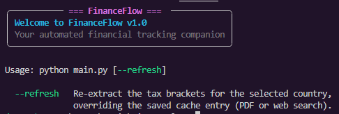
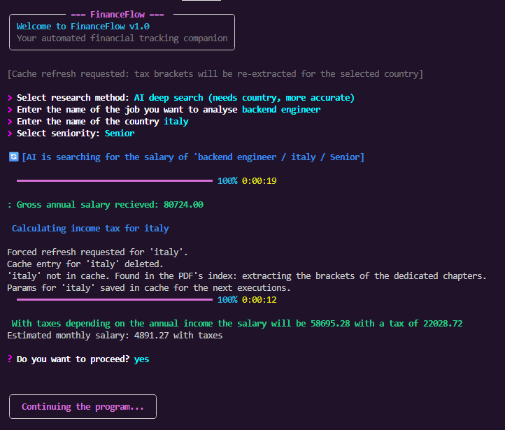
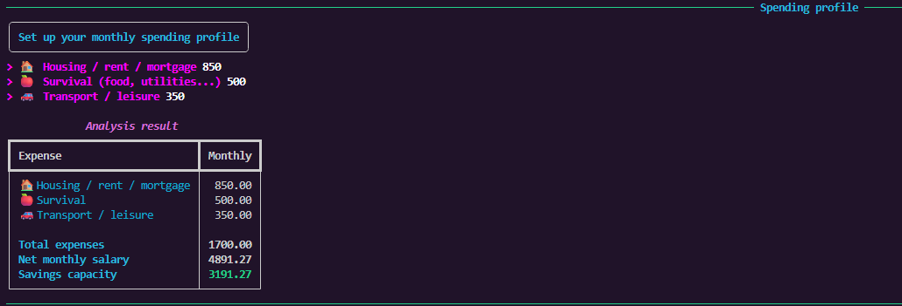
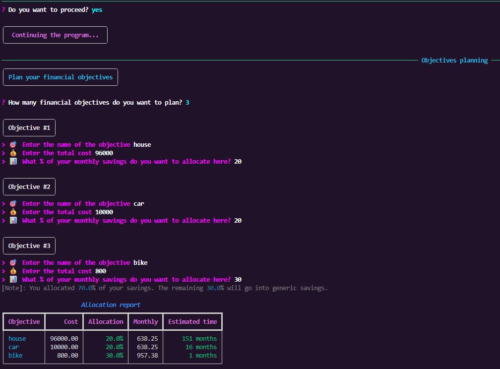

# FinanceFlow

Automated CLI salary & income-tax planner. Enter a job, country and seniority, and
FinanceFlow estimates your gross salary, applies the country's income-tax brackets,
then lets you plan savings and financial objectives.

## Features

- **Two research modes**
  - **AI deep search (Gemini)** – web search with Google Search grounding; returns a
    salary for a specific job + country + seniority, handling ranges and currency.
  - **Jobdatalake quick search** – fast global estimate from live job postings
    (no AI quota needed).
- **Income tax calculation** – national/federal brackets from the OECD
  `TaxingWages2026.pdf` (local chapters) or AI web search, with currency conversion
  (USD → local → brackets → USD) via `open.er-api.com`.
- **Caching** – tax brackets and exchange rates are cached locally
  (`fiscalCacheParams.json`, `exchangeRates.json`). Use `--refresh` to force
  re-extraction of tax brackets.
- **Spending profile & objectives planning** – monthly expenses vs. net salary,
  savings capacity, and allocation of savings to financial objectives with
  time-to-achieve estimates.

## Preview









## Requirements

- Python 3.10+ (tested with 3.14)
- API keys (free):
  - **Gemini**: https://aistudio.google.com (used for AI salary search and tax data)
  - **Jobdatalake**: https://jobdatalake.com/register (1,000 free credits; used for
    quick salary estimates)

## Setup

```bash
git clone https://github.com/traynertunder2047-bit/FinanceFlow
cd FinanceFlow
python -m venv .venv
.venv\Scripts\activate        # Windows
pip install -r requirements.txt
copy .env.example.txt .env    # Windows; then edit .env
```

Then set `JOBDATALAKE_API_KEY` and `GEMINI_API_KEY` in `.env`.

## Usage

```bash
python main.py           # interactive flow
python main.py --refresh # force re-extraction of tax brackets (ignore cache)
python main.py --help    # usage help
```

Follow the prompts: research method → job → country → seniority → tax → spending
profile → objectives planning.

## Notes / known limitations

- Tax uses **national/federal brackets only** – social security, cantonal/state and
  municipal taxes are not included, so the tax figure can be lower than the real
  total burden (e.g. Switzerland).
- Jobdatalake salaries are global postings; results are averages of matched jobs,
  so they skew toward global (often US/remote) market rates, not your local market.
- If Gemini hits its quota (HTTP 429), the AI salary search fails and the program
  exits with an error; tax calculation falls back to a 0 tax estimate.
  